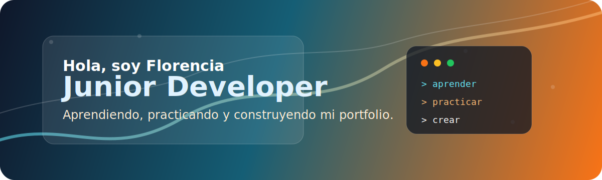

  

<h1 align="center">Florencia Villalonga</h1>

  <strong>Junior Developer en formación</strong> 
  Aprendiendo desarrollo de aplicaciones, bases de datos y buenas prácticas paso a paso.

  
  
  

---

## Sobre mí

Estoy dando mis primeros pasos como desarrolladora junior. Me interesa seguir aprendiendo, practicar con proyectos reales y mejorar mi forma de resolver problemas con código.

Actualmente estoy construyendo una base para mi portfolio, incorporando proyectos académicos y personales a medida que avanzo.

## Tecnologías que estoy practicando

  

También estoy trabajando con **DataFlex Studio 25.0**, desarrollo de aplicaciones y conexión a bases de datos **MySQL/MariaDB**.

## En qué estoy enfocada

- Aprender buenas prácticas de desarrollo.
- Crear proyectos simples pero funcionales.
- Profundizar en desarrollo de aplicaciones.
- Mejorar el manejo de bases de datos.
- Preparar este perfil como futuro portfolio profesional.

## Proyectos

| Proyecto | Descripción | Estado |
| --- | --- | --- |
| [FutbolWebApp](https://github.com/FlorVillalonga/FutbolWebApp) | Aplicación web en DataFlex conectada a MySQL/MariaDB. | En desarrollo |
| [Practicas.DataControl](https://github.com/FlorVillalonga/Practicas.DataControl) | Prácticas y ejercicios de aprendizaje. | En práctica |

## Próximamente

- Agregar una presentación más completa.
- Sumar capturas de proyectos.
- Publicar avances y aprendizajes.
- Incorporar enlaces profesionales cuando estén listos.

---

  Gracias por visitar mi perfil.

