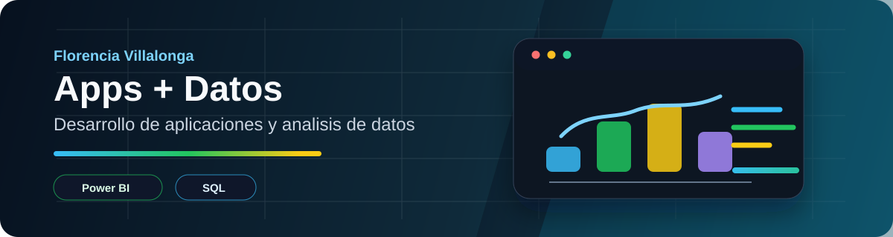

  

<h1 align="center">Florencia Villalonga</h1>

  <strong>Desarrolladora Junior | DAM finalizado en 2026</strong> 
  Desarrollo de aplicaciones y análisis de datos, con experiencia en reporting, procesos y automatizaciones.

  
  
  
  

  
  
  
  

---

## Sobre mí

Soy desarrolladora junior y este año finalicé mis estudios de **Desarrollo de Aplicaciones Multiplataforma (DAM)**.

Estoy construyendo mi camino profesional poco a poco, combinando proyectos académicos, aprendizaje constante y experiencias freelance. No me considero una persona con una gran trayectoria todavía, pero sí con muchas ganas de seguir creciendo, entender bien cada necesidad y adaptarme a cada cliente para buscar soluciones útiles, optimizadas y personalizadas.

Además de mi formación técnica, cuento con experiencia previa en el área de **seguros** y **banca-seguros**, junto con una tecnicatura en seguros realizada en Argentina. Ese recorrido me ayudó a desarrollar una mirada analítica, orientada al detalle, a los procesos y a la comprensión de entornos donde la información, la gestión y la toma de decisiones son clave.

Mi foco principal está en el **desarrollo de aplicaciones** y el **análisis de datos**. Me interesa crear herramientas que ayuden a ordenar información, ahorrar tiempo y resolver necesidades reales de negocio, combinando bases de datos, reporting y automatización de procesos.

## Experiencia práctica

- Análisis de datos y reportería con **Power BI**, preparando informes y visualizaciones orientadas a la toma de decisiones.
- Automatización de flujos de **WhatsApp integrados con CRM**, adaptados a procesos concretos de negocio.
- Integraciones con **Wasapi** para clínicas dentales, conectando la comunicación por WhatsApp con la gestión comercial y operativa.
- Automatizaciones con Wasapi para empresas vinculadas a la venta e instalación de centros de recarga para vehículos eléctricos.
- Experiencia laboral en **seguros** y **banca-seguros**, trabajando en entornos donde el análisis, la precisión y la comprensión del cliente son fundamentales.
- Trabajo freelance enfocado en escuchar el problema, entender el flujo real del cliente y proponer una solución sencilla, mantenible y lo más eficiente posible.

## Tecnologías que estoy practicando

  
   
  
  

## En qué estoy enfocada

- Seguir mejorando como desarrolladora junior.
- Profundizar en desarrollo de aplicaciones, bases de datos y análisis de datos.
- Crear soluciones prácticas para necesidades reales.
- Automatizar procesos repetitivos mediante integraciones.
- Unir mi experiencia previa en seguros, análisis y atención al cliente con soluciones tecnológicas útiles.
- Preparar este perfil como portfolio profesional.

## Proyectos

| Proyecto | Descripción | Estado |
| --- | --- | --- |
| [FutbolWebApp](https://github.com/FlorVillalonga/FutbolWebApp) | Aplicación web en DataFlex conectada a MySQL/MariaDB. | Finalizado |
| [Practicas.DataControl](https://github.com/FlorVillalonga/Practicas.DataControl) | Prácticas finalizadas centradas en Moodle y DataFlex. | Finalizado |

## Próximamente

- Sumar capturas de proyectos.
- Publicar avances y aprendizajes.
- Organizar proyectos por tecnologías y tipo de solución.
- Incorporar enlaces profesionales cuando estén listos.

---

  Gracias por visitar mi perfil.

